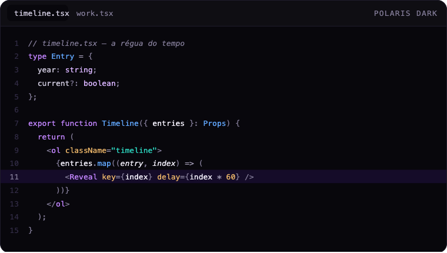

<div align="center">
  
  <h1>Polaris</h1>
  <p><strong>A dark theme for <a href="https://zed.dev">Zed</a> with a violet north star.</strong></p>
  <p>Syntax colours derived from a working design system — not picked in isolation.</p>
</div>



## Why it looks coherent

Most themes start from the syntax palette. Polaris started from the other end.

It began as the code-block theme for a portfolio site, so every syntax colour had to already
exist in that site's design system. Keywords reuse the brand violet. Types and functions reuse
the accent of one product, strings the accent of another, numbers a third. Nothing was invented
for the editor.

The side effect is that the palette is **narrow on purpose** — five hues doing real work instead
of twelve competing for attention — and the greys carry a violet bias, so nothing reads as
neutral sludge next to the accents.

## Install

### From the Zed extension store

Not published yet. Once it is: `zed: extensions` → search **Polaris** → Install.

### Manually

```sh
mkdir -p ~/.config/zed/themes
curl -o ~/.config/zed/themes/polaris.json \
  https://raw.githubusercontent.com/viniengelage/polaris-theme/main/themes/polaris.json
```

Then `cmd+K cmd+T` → **Polaris Dark**. Zed picks up new theme files immediately — no restart.

### As a dev extension

Clone this repository, then in Zed: `zed: extensions` → **Install Dev Extension** → select the
cloned folder. Edits to `themes/polaris.json` hot-reload.

## Palette

### Syntax

| Colour | Hex | Carries | Origin |
| --- | --- | --- | --- |
| Violet | `#C084FC` | keywords, JSX/HTML tags, markdown inline code, preprocessor | brand accent |
| Light violet | `#D8B4FE` | built-in types (`string`, `boolean`), enums, namespaces, CSS selectors | brand accent, lighter step |
| Blue | `#60A5FA` | types, functions, methods, labels, link text | product accent |
| Teal | `#2DD4BF` | strings, link URIs | product accent |
| Amber | `#E8B368` | numbers, booleans, constants, JSX/HTML attributes, escapes, interpolation | product accent |
| Grey | `#837C98` | comments *(italic)*, punctuation, inlay hints | ink 400 |
| Light grey | `#C7C2D6` | editor foreground, object properties, attributes | ink 200 |
| White | `#EDEAF5` | variables, parameters *(italic)*, markdown titles | ink 100 |
| Lime | `#BEF264` | diff added, git created | — |
| Rose | `#FB7185` | diff removed, errors | — |
| Deep violet | `#6D28D9` | active-line veil (14%), AI ghost text | brand accent, deepest step |

### Surfaces

| Hex | Used for |
| --- | --- |
| `#08070C` | editor and terminal background |
| `#0E0D14` | panels, tabs, title bar, status bar |
| `#13111B` | menus, popovers, completions |
| `#1F1C2B` | borders |
| `#322C46` | line numbers, indent guides |

`#08070C` rather than `#000`: pure black smears on OLED panels.

The elevation ladder runs **inwards**, not outwards — the editor is the deepest surface and the
chrome sits above it. That is deliberate: it makes the code the floor of the window rather than a
panel floating on top of one.

## Three decisions you will notice

**Types and functions share the blue.** `Entry` and `.map` come out the same colour. Violet
already carries the keyword, and opening a third hue for types made every line noisy. If you
want them apart, `#88BCFB` is a lighter sibling already present in the terminal ramp.

**JSX and HTML attributes are amber.** `className`, `key` and `delay` take the same colour as
numbers. The collision is accepted, not overlooked: in `delay={index * 60}` the attribute and the
number match. The alternative was a sixth hue, which the palette does not have room for.

**AI ghost text is deep violet.** `#6D28D9` is used by no real token anywhere in the theme, which
is exactly the point — an inline completion can never be mistaken for code that already exists in
the file. It also reads dimmer than any live token while staying above the contrast of most
editors' default ghost text.

## Coverage

150 style keys, 50 tree-sitter captures, and the full 16-colour terminal ANSI ramp with `dim` and
`bright` steps. Git states, diagnostics, search matches, document highlights, indent guides,
scrollbars and collaboration cursors are all mapped rather than left to Zed's fallbacks.

Italics are used in exactly three places — comments, function parameters and AI ghost text — so
they stay informative instead of decorative.

## Development

`themes/polaris.json` is the source of truth; it validates against
[Zed's theme schema](https://zed.dev/schema/themes/v0.2.0.json).

The brand mark and the preview both live as vector (`assets/icon.svg`, `assets/preview.svg`).
Regenerate the raster exports with:

```sh
./scripts/render-assets.sh
```

macOS ships no SVG rasteriser, so the script drives headless Chrome and crops with `sips`. Read
the comments in it before changing the window sizes — both tools have quirks that the current
numbers work around.

## Roadmap

- Publish to the Zed extension registry
- VS Code and Cursor port
- A light variant, if there is demand

## Licence

[MIT](LICENSE) © Vinicios Engelage
